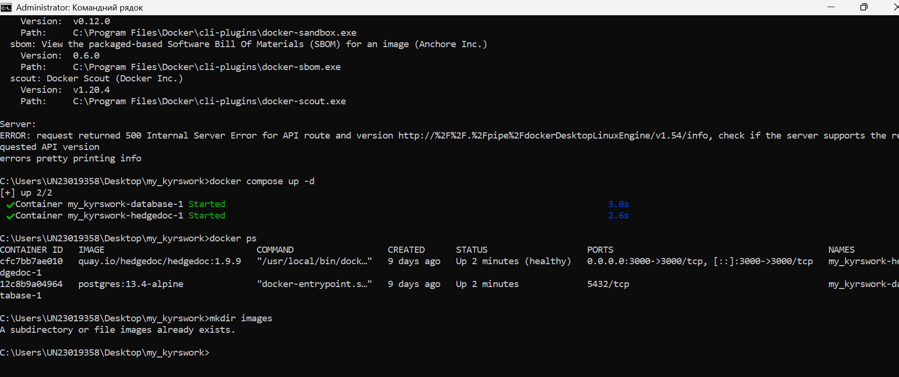

# HedgeDoc Docker Deployment

## 1. Назва та опис проєкту
**Тема:** Розробка архітектури та контейнеризація HedgeDoc для забезпечення відтворюваності та масштабованості.
**Опис:** Цей проєкт реалізує автоматизоване розгортання платформи для спільної роботи з нотатками HedgeDoc. Використання Docker Compose дозволяє швидко розгорнути повний стек технологій (додаток + база даних) без ручного налаштування сервера.

## 2. Вимоги до середовища
Для успішного запуску проєкту необхідно:
* **Docker:** версія 20.10 або вище.
* **Docker Compose:** версія 2.0 або вище.
* **ОС:** Windows 10/11 (з Docker Desktop), Linux або macOS.
* **Пам'ять:** мінімум 2 ГБ ОЗП.

## 3. Покрокова інструкція розгортання
1. **Клонування проєкту:**
   Завантажте файли з репозиторію у робочу папку.
2. **Підготовка конфігурації:**
   Переконайтеся, що файл `docker-compose.yml` знаходиться у кореневій папці.
3. **Запуск контейнерів:**
   Відкрийте термінал у папці проєкту та виконайте:
   
   docker compose up -d
Очікування:
Зачекайте 10-15 секунд для ініціалізації бази даних PostgreSQL.

4. Опис змінних середовища
У даній реалізації основні параметри сконфігуровані безпосередньо у docker-compose.yml для спрощення розгортання:

HD_DB_URL: посилання для підключення до PostgreSQL.

POSTGRES_USER / POSTGRES_PASSWORD: облікові дані бази даних.

HD_URL: локальна адреса сервісу.

5. Перевірка роботи
Після запуску інтерфейс та сервіси доступні за наступними портами:

HedgeDoc Web UI: http://localhost:3000

PostgreSQL Database: порт 5432 (внутрішній).

!Веб-інтерфейс HedgeDoc у браузері:](images/hedgedoc.png)

6. Зупинка та очищення
Для зупинки сервісів та повного видалення контейнерів разом із даними (volumes) виконайте:

docker compose down --volumes
7. Автор та посилання
Автор проєкту: Олена Самарець.

Керівник: к.п.н., доцент Павленко М.П.

Курсова робота: «Удосконалення змісту навчання "Хмарні сервіси" для здобувачів професійної освіти».
